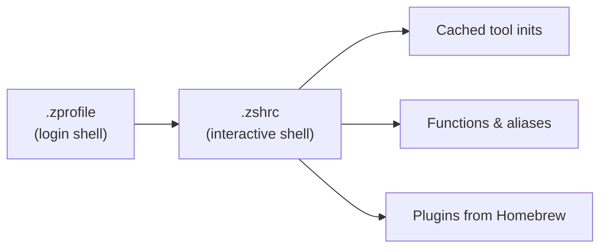

# Zsh Configuration

## Startup Architecture

The shell initializes in two phases:



### `.zprofile` — Login Shell

Runs once when a login shell starts. Sets up foundational paths:

- **Homebrew**: Hardcoded paths (avoids expensive `brew shellenv` eval)
    - ARM: `/opt/homebrew`
    - Intel: `/usr/local`
- **PATH additions**: `~/.local/bin`, `~/.local/scripts`, Go bin
- **Mise**: Shims for non-interactive shells + `mise activate` for interactive

### `.zshrc` — Interactive Shell

Only runs for interactive shells (`[[ $- != *i* ]] && return`).

## Startup Optimization

The key to fast startup is the `_cached_eval()` helper:

```bash
_cached_eval() {
  local name=$1; shift
  local cache="$_zsh_cache/$name.zsh"
  local bin="${commands[$name]:-}"
  if [[ -n "$bin" ]]; then
    if [[ ! -f "$cache" || "$bin" -nt "$cache" ]]; then
      eval "$@" > "$cache" 2>/dev/null
    fi
    source "$cache"
  fi
}
```

**How it works:**

1. Each tool's init output is cached to `~/.cache/zsh/<tool>.zsh`
2. Cache is only regenerated when the tool binary changes (via mtime comparison)
3. Sourcing a cached file is ~1ms vs 50-200ms for running the tool

**Cached tools:**

| Tool | Init Command |
|------|-------------|
| Starship | `starship init zsh` |
| FZF | `fzf --zsh` |
| Zoxide | `zoxide init zsh` |
| Atuin | `atuin init zsh --disable-up-arrow` |
| Carapace | `carapace _carapace` |
| Mise | `mise activate zsh` |
| Worktrunk | `wt config shell init zsh` |
| kubectl | `kubectl completion zsh` |
| Helm | `helm completion zsh` |
| talosctl | `talosctl completion zsh` |

!!! tip "Regenerating cache"
    Delete `~/.cache/zsh/` to force all tools to regenerate their init scripts on next shell startup.

## Environment Variables

| Variable | Value | Purpose |
|----------|-------|---------|
| `EDITOR` | `vim` | Default editor |
| `STARSHIP_CONFIG` | `~/.config/starship/starship.toml` | Prompt config location |
| `HOMEBREW_BUNDLE_FILE` | `~/.config/homebrew/Brewfile` | Brewfile location |
| `AWS_VAULT_BACKEND` | `keychain` | AWS Vault uses macOS keychain |
| `K9S_CONFIG_DIR` | `~/.config/k9s` | K9s config location |
| `TF_PLUGIN_CACHE_DIR` | `~/.terraform.d/plugin-cache` | Terraform provider cache |
| `GPG_TTY` | `$(tty)` | GPG agent terminal |
| `CARAPACE_BRIDGES` | `zsh,fish,bash,inshellisense` | Completion bridge modes |

## History

```bash
HISTFILE=~/.zsh_history
HISTSIZE=100000
SAVEHIST=100000
```

Options enabled:

- `share_history` — Share across sessions
- `hist_ignore_all_dups` — No duplicate entries
- `hist_ignore_space` — Commands starting with space are private
- `hist_reduce_blanks` — Trim whitespace

## Completions

**Compinit** is cached with `zcompile` for fast loading.

**Carapace** bridges completions from multiple shells (zsh, fish, bash) into one engine.

**Custom just completion** overrides carapace's version to handle `::` module syntax correctly:

```bash
_just_completion() {
    local -a recipes
    recipes=(${(s: :)$(just --summary 2>/dev/null)})
    compadd -X 'recipes' -- "${recipes[@]}"
}
compdef _just_completion just
```

## Plugins

Loaded from Homebrew (no plugin manager):

```bash
source $HOMEBREW_PREFIX/share/zsh-autosuggestions/zsh-autosuggestions.zsh
source $HOMEBREW_PREFIX/share/zsh-fast-syntax-highlighting/fast-syntax-highlighting.plugin.zsh
```

## Key Bindings

| Key | Action |
|-----|--------|
| ++up++ | Prefix history search backward |
| ++down++ | Prefix history search forward |

Type a prefix (e.g., `kubectl`) then press ++up++ to search through matching history entries.

## FZF Integration

FZF uses the **Catppuccin Mocha** color scheme:

- ++ctrl+t++ — File picker with bat preview
- ++ctrl+r++ — History search (handled by atuin)
- ++alt+c++ — Directory picker

## Background Tasks

GPG agent is auto-started in the background:

```bash
{
  pgrep -x gpg-agent >/dev/null || gpgconf --launch gpg-agent
} &!
```
